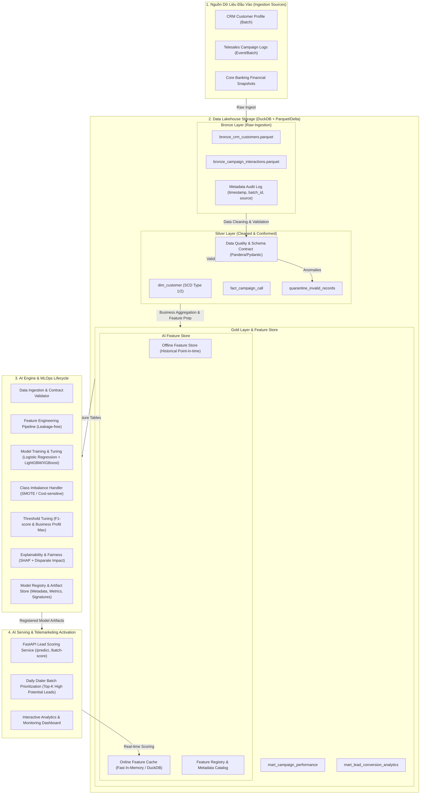

# Kiến Trúc Bổ Sung Data Lakehouse Chuẩn AI Engine Cho Dự Án Bank Marketing

Dự án hiện tại là một nghiên cứu Machine Learning dựa trên Jupyter Notebook (`notebooks/BankMarketing.ipynb`) phân tích dự đoán khách hàng gửi tiền tiết kiệm có kỳ hạn (Term Deposit). Để đưa dự án lên cấp độ **Enterprise Data & AI Engineering**, kế hoạch này thiết kế và bổ sung toàn diện một hệ thống **Data Lakehouse chuẩn AI Engine** (Medallion Architecture: Bronze - Silver - Gold, Feature Store, Pipeline Orchestration, MLOps, Model Registry, SHAP Explainability và Telemarketing Lead Scoring API).

---

## 1. Tổng Quan Kiến Trúc Đề Xuất (Target Architecture)



---

## 2. Chi Tiết Từng Thành Phần Trong Hệ Thống

### 2.1. Tầng Lưu Trữ Data Lakehouse (Medallion Architecture)
Sử dụng **Apache Parquet / Delta Lake** kết hợp công cụ truy vấn hiệu năng cao **DuckDB** (nhẹ, chuẩn SQL ANSI, không phụ thuộc cụm cluster cồng kềnh, tương thích 100% khi mở rộng lên AWS S3 / Azure ADLS / Databricks):

1. **Bronze Layer (`data/lakehouse/bronze/`)**:
   - Lưu trữ dữ liệu thô nguyên bản không qua chỉnh sửa (raw, immutable, append-only).
   - Bổ sung trường metadata kỹ thuật: `_ingested_at`, `_batch_id`, `_source_system`.
   - Lưu vết lịch sử ingest phục vụ data lineage và audit compliance ngành ngân hàng.

2. **Silver Layer (`data/lakehouse/silver/`)**:
   - Chuẩn hóa kiểu dữ liệu (`casting`), loại bỏ dữ liệu trùng lặp (`deduplication`).
   - Xử lý các giá trị `unknown` trong `job`, `education`, `contact`, `poutcome` theo quy tắc ngân hàng.
   - **Data Quality Contracts**: Sử dụng `Pandera` / `Pydantic` để kiểm tra schema, chặn giá trị ngoại lai vô lý (`age < 18` hoặc `age > 100`, `balance` bất thường, `duration < 0`).
   - Phân tách kiến trúc hình sao/bông tuyết chuẩn (Conformed Dimensional Modeling):
     - `dim_customer`: ID khách hàng, tuổi, nghề nghiệp, tình trạng hôn nhân, học vấn, nợ xấu, số dư, khoản vay.
     - `fact_campaign_interaction`: Ngày gọi, tháng, thời lượng cuộc gọi, số lần tiếp xúc (`campaign`), ngày liên lạc trước (`pdays`), kết quả trước (`poutcome`), nhãn phản hồi (`y`).
     - `quarantine_records`: Nơi lưu các bản ghi lỗi chất lượng để kiểm toán viên rà soát.

3. **Gold Layer (`data/lakehouse/gold/`)**:
   - **Data Marts**:
     - `mart_telemarketing_efficiency`: Đánh giá ROI theo tháng, kênh liên lạc (`cellular` vs `telephone`), nhóm tuổi.
     - `mart_lead_conversion`: Tỷ lệ chuyển đổi theo số dư, tình trạng nợ và kết quả chiến dịch trước.
   - **Offline Feature Store Mart**: Bảng đặc trưng phục vụ huấn luyện mô hình đã được tách biệt biến mục tiêu, đảm bảo không rò rỉ dữ liệu (No Data Leakage).

---

### 2.2. AI Feature Store Engine
Xây dựng một Feature Store module độc lập (`src/lakehouse/feature_store.py`):
- **Feature Definitions & Catalog**:
  - *Nhân khẩu học*: `age_group` (thanh niên, trung niên, người cao tuổi), `job_risk_category` (nhóm thu nhập ổn định như management/admin vs nhóm rủi ro).
  - *Tài chính cá nhân*: `balance_tier` (âm, thấp, trung bình, VIP), `financial_pressure_index` (tổng hợp từ `default`, `housing`, `loan`).
  - *Tương tác & Chiến dịch*: `is_previously_contacted` (dựa trên `pdays != -1`), `campaign_fatigue_score` (số lần gọi quá nhiều dẫn đến phản cảm), `interaction_month_quarter`.
  - *Lịch sử phản hồi*: `past_success_flag` (`poutcome == 'success'`).
- **Offline Feature Engine**: Trích xuất dữ liệu có gán mốc thời gian (`point-in-time correct join`) tạo tập Train / Validation / Test hoàn chỉnh.
- **Online Feature Engine**: Cung cấp cơ chế nạp nhanh vector đặc trưng phục vụ chấm điểm trực tiếp trong lúc tư vấn viên Telesales đang gọi điện.

---

### 2.3. AI / MLOps Engine
Chuẩn hóa toàn bộ logic phân tích trong notebook thành các service chuyên nghiệp:
- **Data Ingestion & Contract Validation**: Module tự động nhận dạng file CSV/Parquet và kiểm duyệt chất lượng trước khi nạp vào Lakehouse.
- **Model Training Pipeline**:
  - Hỗ trợ mô hình Baseline: `LogisticRegression` (giải thích trọng số kinh tế).
  - Hỗ trợ mô hình SOTA Gradient Boosting: `LightGBM` / `XGBoost` (tối ưu xử lý đặc trưng phi tuyến và mất cân bằng).
  - Xử lý mất cân bằng lớp (Class Imbalance): Tích hợp `SMOTE` và `class_weight='balanced'`.
  - Bộ tìm kiếm ngưỡng quyết định tối ưu (`Threshold Tuner`): Cực đại hóa F1-score và tính toán **Lợi nhuận ròng dự kiến (Expected Net Profit)** của chiến dịch dựa trên chi phí cuộc gọi và giá trị hợp đồng tiền gửi.
- **Explainability & Model Governance**:
  - Tích hợp `SHAP Engine` (Summary plot, Force plot, Local attribution).
  - Kiểm tra độ công bằng (Fairness Audit): Đo lường Disparate Impact theo độ tuổi (`age`) để đảm bảo thuật toán tuân thủ quy chuẩn đạo đức AI trong tài chính ngân hàng.
- **Model Registry**:
  - Quản lý phiên bản mô hình (Version: `v1.0.0`, timestamp, model file `.pkl` / `.joblib`, config tham số, metric kết quả: ROC-AUC, F1, PR-AUC).

---

### 2.4. Telemarketing Serving & Activation Engine
1. **Batch Scoring Pipeline**:
   - Chạy định kỳ đầu mỗi chiến dịch: Quét toàn bộ khách hàng trong Lakehouse Gold Layer, tính xác suất `P(y=yes)`, gán hạng ưu tiên (`Priority: Tier 1 - Rất tiềm năng`, `Tier 2 - Tiềm năng`, `Tier 3 - Cân nhắc`, `Tier 4 - Không gọi`).
   - Xuất danh sách phân bổ thông minh cho hệ thống Tổng đài tự động (Predictive Dialer).
2. **Real-time Inference REST API (`FastAPI`)**:
   - `GET /health`: Kiểm tra tình trạng hệ thống và Lakehouse.
   - `POST /api/v1/predict`: Nhận thông tin 1 khách hàng, trả về xác suất chuyển đổi, nhãn đề xuất, và Top 3 lý do giải thích bằng SHAP (ví dụ: *"Khách hàng này có xác suất chuyển đổi 78% do: Kết quả chiến dịch trước thành công (+0.32), Số dư trên 5000 EUR (+0.25), Không vướng nợ vay (+0.12)"*).
   - `POST /api/v1/batch-predict`: Chấm điểm tệp danh sách cuộc gọi mới tải lên.
   - `GET /api/v1/features/{customer_id}`: Tra cứu hồ sơ đặc trưng 360 độ từ Lakehouse.
3. **CLI Quản Trị Hệ Thống (`src/cli.py`)**:
   - Dòng lệnh tập trung giúp Data Engineer & Data Scientist vận hành toàn bộ luồng công việc chỉ bằng 1 câu lệnh.

---

## 3. Cấu Trúc Thư Mục Sau Khi Bổ Sung

```text
BankMarketing/
├── .gitignore
├── pyproject.toml                     # Cập nhật dependencies (duckdb, pandera, fastapi, uvicorn, lightgbm, joblib)
├── requirements.txt                   # Danh sách thư viện đồng bộ hóa
├── README.md                          # Cập nhật tài liệu bổ sung Data Lakehouse AI Engine
├── config/                            # Cấu hình hệ thống tập trung
│   ├── lakehouse_config.yaml          # Cấu hình đường dẫn Bronze/Silver/Gold, DuckDB path
│   └── model_config.yaml              # Cấu hình hyperparameters, threshold, feature lists
├── data/                              # Cấu trúc lưu trữ Data Lakehouse (Local Lakehouse)
│   ├── raw/                           # Nguồn dữ liệu đầu vào gốc (CSV, ARFF)
│   └── lakehouse/
│       ├── bronze/                    # Dữ liệu thô kèm metadata audit (Parquet)
│       ├── silver/                    # Dữ liệu đã làm sạch, chuẩn hóa quan hệ (Parquet)
│       ├── gold/                      # Analytical marts & Feature Store tables (Parquet)
│       ├── quarantine/                # Dữ liệu lỗi chất lượng bị cách ly
│       └── bank_lakehouse.duckdb      # DuckDB Catalog & Analytics Engine
├── sample_data/
│   ├── bank_raw_sample.csv            # File mẫu phục vụ demo & test pipeline độc lập
│   └── sample_leads_to_score.csv      # File mẫu khách hàng cần chấm điểm
├── models/                            # Thư mục lưu Model Registry & Artifacts
│   ├── baseline_logistic_regression.joblib
│   ├── best_model_lightgbm.joblib
│   └── model_metadata.json
├── docs/                              # Giữ nguyên các tài liệu hiện có & bổ sung kiến trúc
│   └── architecture/
│       └── data_lakehouse_ai_engine.md
├── notebooks/                         # Notebooks hiện tại của người dùng (giữ nguyên không làm xáo trộn)
│   ├── BankMarketing.ipynb
│   └── EDA_bank_.ipynb
├── tests/                             # Bộ kiểm thử tự động toàn diện
│   ├── test_data_contracts.py         # Kiểm tra schema & Data Quality hợp lệ
│   ├── test_lakehouse_pipeline.py     # Kiểm tra luồng Bronze -> Silver -> Gold
│   ├── test_feature_store.py          # Kiểm tra Feature Store tính toán đúng, không leak
│   ├── test_model_engine.py           # Kiểm tra huấn luyện, đánh giá, SHAP
│   └── test_api_serving.py            # Kiểm tra FastAPI endpoints
└── src/                               # MÃ NGUỒN CHUẨN HÓA DATA LAKEHOUSE & AI ENGINE
    ├── __init__.py
    ├── cli.py                         # CLI Runner cho toàn bộ hệ thống
    ├── config.py                      # Parser đọc file cấu hình YAML
    ├── lakehouse/                     # MODULE DATA LAKEHOUSE
    │   ├── __init__.py
    │   ├── db.py                      # DuckDB connection manager & SQL helpers
    │   ├── contracts.py               # Pandera/Pydantic schemas cho Bronze/Silver/Gold
    │   ├── ingestion.py               # Module nạp dữ liệu raw vào Bronze Layer
    │   ├── transformation.py          # Module chuyển đổi Bronze -> Silver (Cleaning & Quality check)
    │   ├── marts.py                   # Module xây dựng Gold Marts phục vụ phân tích
    │   └── feature_store.py           # Offline & Online Feature Store
    ├── ai_engine/                     # MODULE AI & MLOPS ENGINE
    │   ├── __init__.py
    │   ├── features.py                # Feature Engineering & Preprocessing transformer
    │   ├── trainer.py                 # Huấn luyện mô hình (LogisticRegression, LightGBM)
    │   ├── evaluator.py               # Đánh giá ROC-AUC, PR curve, Threshold Optimizer
    │   ├── explainability.py          # SHAP explainer & Lead conversion driver analysis
    │   └── registry.py                # Lưu trữ, versioning và load model
    └── serving/                       # MODULE PHỤC VỤ TRIỂN KHAI THỰC TẾ
        ├── __init__.py
        ├── batch_scorer.py            # Chấm điểm hàng loạt cho chiến dịch telesales
        └── app.py                     # REST API FastAPI phục vụ Lead Scoring theo thời gian thực
```

---

## 4. Kế Hoạch Triển Khai Chi Tiết Từng Bước (Phased Tasks)

### Giai đoạn 1: Chuẩn bị Cấu hình & Mẫu Dữ liệu (Foundation)
- [ ] Cập nhật [requirements.txt](file:///c:/Users/ADMIN%2088/OneDrive/Desktop/Projects/BankMarketing/requirements.txt) và [pyproject.toml](file:///c:/Users/ADMIN%2088/OneDrive/Desktop/Projects/BankMarketing/pyproject.toml) với các thư viện: `duckdb`, `pyarrow`, `pandera`, `pydantic`, `fastapi`, `uvicorn`, `lightgbm`, `joblib`, `pyyaml`.
- [ ] Tạo file cấu hình tập trung [config/lakehouse_config.yaml](file:///c:/Users/ADMIN%2088/OneDrive/Desktop/Projects/BankMarketing/config/lakehouse_config.yaml) và [config/model_config.yaml](file:///c:/Users/ADMIN%2088/OneDrive/Desktop/Projects/BankMarketing/config/model_config.yaml).
- [ ] Khởi tạo module đọc cấu hình [src/config.py](file:///c:/Users/ADMIN%2088/OneDrive/Desktop/Projects/BankMarketing/src/config.py).
- [ ] Chuẩn bị dữ liệu mẫu đại diện chuẩn hóa [sample_data/bank_raw_sample.csv](file:///c:/Users/ADMIN%2088/OneDrive/Desktop/Projects/BankMarketing/sample_data/bank_raw_sample.csv) dựa trên bộ dữ liệu Bank Marketing (17 trường: age, job, marital, education, default, balance, housing, loan, contact, day, month, duration, campaign, pdays, previous, poutcome, y).

### Giai đoạn 2: Xây dựng Module Data Lakehouse (Medallion Architecture)
- [ ] [src/lakehouse/db.py](file:///c:/Users/ADMIN%2088/OneDrive/Desktop/Projects/BankMarketing/src/lakehouse/db.py): Xây dựng DuckDB Engine quản lý truy vấn Parquet và đồng bộ metadata.
- [ ] [src/lakehouse/contracts.py](file:///c:/Users/ADMIN%2088/OneDrive/Desktop/Projects/BankMarketing/src/lakehouse/contracts.py): Định nghĩa schema kiểm duyệt chất lượng dữ liệu (Data Quality Contract) với Pandera/Pydantic.
- [ ] [src/lakehouse/ingestion.py](file:///c:/Users/ADMIN%2088/OneDrive/Desktop/Projects/BankMarketing/src/lakehouse/ingestion.py): Pipeline nạp raw data vào Bronze Layer kèm metadata kiểm toán (`_ingested_at`, `_batch_id`).
- [ ] [src/lakehouse/transformation.py](file:///c:/Users/ADMIN%2088/OneDrive/Desktop/Projects/BankMarketing/src/lakehouse/transformation.py): Pipeline làm sạch dữ liệu, kiểm duyệt contract, phân loại dữ liệu chuẩn vào Silver Layer (`dim_customer`, `fact_campaign_call`) và đẩy dữ liệu vi phạm vào `quarantine`.
- [ ] [src/lakehouse/marts.py](file:///c:/Users/ADMIN%2088/OneDrive/Desktop/Projects/BankMarketing/src/lakehouse/marts.py): Xây dựng các Gold Data Marts phân tích chiến dịch tiếp thị.
- [ ] [src/lakehouse/feature_store.py](file:///c:/Users/ADMIN%2088/OneDrive/Desktop/Projects/BankMarketing/src/lakehouse/feature_store.py): Xây dựng Offline/Online Feature Store, lưu trữ vector đặc trưng không rò rỉ dữ liệu.

### Giai đoạn 3: Xây dựng Module AI & MLOps Engine
- [ ] [src/ai_engine/features.py](file:///c:/Users/ADMIN%2088/OneDrive/Desktop/Projects/BankMarketing/src/ai_engine/features.py): Pipeline chuẩn hóa đặc trưng (One-hot encoding, Scaling, Feature Engineering logic: `balance_tier`, `financial_pressure_index`, `contact_recency`).
- [ ] [src/ai_engine/trainer.py](file:///c:/Users/ADMIN%2088/OneDrive/Desktop/Projects/BankMarketing/src/ai_engine/trainer.py): Engine huấn luyện đa mô hình (Baseline Logistic Regression + High-performance LightGBM) tích hợp xử lý mất cân bằng lớp (`SMOTE` hoặc `scale_pos_weight`).
- [ ] [src/ai_engine/evaluator.py](file:///c:/Users/ADMIN%2088/OneDrive/Desktop/Projects/BankMarketing/src/ai_engine/evaluator.py): Đánh giá ROC-AUC, PR-AUC, Confusion Matrix và thuật toán tự động tối ưu hóa Threshold (Threshold Optimizer) theo hàm tối đa hóa F1 hoặc lợi nhuận kinh doanh.
- [ ] [src/ai_engine/explainability.py](file:///c:/Users/ADMIN%2088/OneDrive/Desktop/Projects/BankMarketing/src/ai_engine/explainability.py): Tích hợp SHAP để tạo giải thích toàn cục (Global feature importance) và cục bộ (Top 3 lý do cho từng khách hàng).
- [ ] [src/ai_engine/registry.py](file:///c:/Users/ADMIN%2088/OneDrive/Desktop/Projects/BankMarketing/src/ai_engine/registry.py): Quản lý lưu/tải mô hình, lưu metadata thông số huấn luyện và metrics vào thư mục [models/](file:///c:/Users/ADMIN%2088/OneDrive/Desktop/Projects/BankMarketing/models).

### Giai đoạn 4: Xây dựng Module Serving & CLI Quản Trị
- [ ] [src/serving/batch_scorer.py](file:///c:/Users/ADMIN%2088/OneDrive/Desktop/Projects/BankMarketing/src/serving/batch_scorer.py): Script đọc khách hàng từ Lakehouse, chấm điểm xác suất mua kỳ hạn, phân nhóm Tier 1/2/3/4 và xuất file chiến dịch gọi điện.
- [ ] [src/serving/app.py](file:///c:/Users/ADMIN%2088/OneDrive/Desktop/Projects/BankMarketing/src/serving/app.py): Khởi tạo FastAPI server cung cấp REST API real-time scoring kèm giải thích SHAP.
- [ ] [src/cli.py](file:///c:/Users/ADMIN%2088/OneDrive/Desktop/Projects/BankMarketing/src/cli.py): CLI interface cho phép chạy các lệnh:
  - `python -m src.cli lakehouse run-all` (chạy trọn vẹn Bronze -> Silver -> Gold)
  - `python -m src.cli ai train --model lightgbm`
  - `python -m src.cli ai evaluate`
  - `python -m src.cli serving batch-score --input sample_data/sample_leads_to_score.csv`
  - `python -m src.cli serving api --port 8000`

### Giai đoạn 5: Kiểm Thử (Testing), Xác Minh (Verification) & Tài Liệu Hóa
- [ ] Viết bộ unit tests & integration tests trong [tests/](file:///c:/Users/ADMIN%2088/OneDrive/Desktop/Projects/BankMarketing/tests).
- [ ] Cập nhật [README.md](file:///c:/Users/ADMIN%2088/OneDrive/Desktop/Projects/BankMarketing/README.md) phản ánh kiến trúc mới, hướng dẫn vận hành Data Lakehouse & AI Engine.
- [ ] Tạo tài liệu kiến trúc kỹ thuật chi tiết trong [docs/architecture/data_lakehouse_ai_engine.md](file:///c:/Users/ADMIN%2088/OneDrive/Desktop/Projects/BankMarketing/docs/architecture/data_lakehouse_ai_engine.md).

---

## 5. Kế Hoạch Xác Minh (Verification Plan)

### Kiểm Thử Tự Động (Automated Tests)
1. **Kiểm thử Data Quality & Schema Contracts**:
   - Chạy lệnh `pytest tests/test_data_contracts.py` để xác minh Pandera schema bắt đúng lỗi ngoại lệ khi dữ liệu vi phạm định dạng.
2. **Kiểm thử luồng Data Lakehouse (Medallion Pipeline)**:
   - Chạy `pytest tests/test_lakehouse_pipeline.py` để kiểm tra quá trình ghi đọc file Parquet qua DuckDB từ Bronze -> Silver -> Gold, xác minh dữ liệu lỗi được đẩy vào `quarantine`.
3. **Kiểm thử AI Engine & Feature Store**:
   - Chạy `pytest tests/test_feature_store.py` và `pytest tests/test_model_engine.py` để kiểm tra trích xuất đặc trưng, huấn luyện mô hình thành công, tính toán SHAP không sinh lỗi.
4. **Kiểm thử API Endpoint (FastAPI)**:
   - Chạy `pytest tests/test_api_serving.py` sử dụng `TestClient` của FastAPI để kiểm tra endpoints `/health`, `/api/v1/predict`, `/api/v1/batch-predict`.

### Kiểm Thử Tích Hợp Đầu-Cuối (End-to-End Integration Run)
1. Thực thi toàn bộ pipeline qua CLI:
   ```bash
   # 1. Chạy Ingestion & Lakehouse Medallion
   python -m src.cli lakehouse ingest --source sample_data/bank_raw_sample.csv
   python -m src.cli lakehouse transform --layer silver
   python -m src.cli lakehouse transform --layer gold

   # 2. Huấn luyện & Đăng ký Model
   python -m src.cli ai train --model lightgbm

   # 3. Chạy Batch Lead Scoring
   python -m src.cli serving batch-score --input sample_data/sample_leads_to_score.csv --output sample_data/scored_leads_output.csv
   ```
2. Khởi chạy FastAPI server trong chế độ test và gửi request HTTP mẫu để xác thực kết quả trả về đúng định dạng JSON chuẩn.

---

## 6. Người Dùng Xem Xét & Thống Nhất Ý Kiến (User Review Required)

> [!IMPORTANT]
> **Lựa chọn Công nghệ Lưu trữ & Truy vấn**:
> - Đề xuất sử dụng **DuckDB + Parquet / Delta** cho tầng Data Lakehouse. Đây là chuẩn kiến trúc hiện đại nhất hiện nay cho các giải pháp Data Lakehouse độc lập (Single-node / Local-first to Cloud), tốc độ xử lý nhanh gấp nhiều lần SQLite hay Pandas thuần, hỗ trợ đầy đủ SQL ANSI, tương thích hoàn toàn khi chuyển dịch sang cụm cloud (Databricks, AWS S3, Azure Data Lake Storage).
> - Nếu bạn có yêu cầu cụ thể sử dụng công nghệ khác (ví dụ: Apache Spark, Snowflake, Feast chuyên biệt), hãy phản hồi để điều chỉnh.

> [!NOTE]
> **Bảo Toàn Các File Cũ**:
> - Tất cả các file hiện có bao gồm [notebooks/BankMarketing.ipynb](file:///c:/Users/ADMIN%2088/OneDrive/Desktop/Projects/BankMarketing/notebooks/BankMarketing.ipynb), [notebooks/EDA_bank_.ipynb](file:///c:/Users/ADMIN%2088/OneDrive/Desktop/Projects/BankMarketing/notebooks/EDA_bank_.ipynb), và toàn bộ các file báo cáo trong [docs/](file:///c:/Users/ADMIN%2088/OneDrive/Desktop/Projects/BankMarketing/docs) sẽ được **giữ nguyên 100%**, không bị ghi đè hay xóa bỏ. Kiến trúc Data Lakehouse AI Engine mới sẽ được tổ chức bài bản trong `src/`, `config/`, `data/`, `tests/` để chuẩn hóa toàn bộ logic phân tích thành hệ thống production.

---

Bạn vui lòng kiểm tra kế hoạch trên và nhấn **Proceed** hoặc phản hồi để tôi bắt đầu tiến hành triển khai từng bước!
